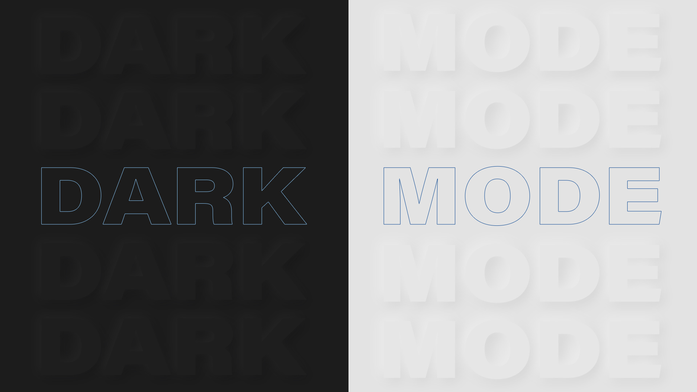

# The Complete Guide to the Dark Mode Toggle

You may have noticed that Dark Mode is becoming more and more a thing. In this article, I provide a complete guide to adding Dark Mode to your website.

> Best Practices to Unlock the Dark Side

Recently, Chris Coyier at CSS-Tricks threw down the gauntlet for anyone who was about "to write a blog post about dark mode." He listed 10 points that would need to be covered.

- Explain Dark Mode
- Provide a demo
- Explain that Dark Mode can happen at the operating system level itself
- Show how JavaScript can know about the OS-level choice
- Let the user have ultimate say over color preference
- Build a theme switcher, including gotchas
- See who else is building Dark Mode toggles
- See who else is writing about it
- Discuss what is and isn't supported
- Make accessibility a main concern

In my post, "[The Complete Guide to the Dark Mode Toggle](https://ryanfeigenbaum.com/dark-mode)," I aim to cover all 10 points (covering some better than others). I offer what I've found to be the best practices for implementing a dark mode toggle, and this repo serves a demo for those best practices.

Check out the [Dark Mode Toggle demo](https://royalfig.github.io/dark-mode-demo/).
